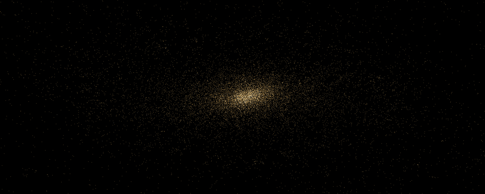

[](Cargo.toml)
[](Cargo.toml)

Newton can tell you exactly how two bodies orbit each other. Add a third and
there is no formula anymore — the only way to know where things end up is to
compute every gravitational pull and step time forward in small increments.
That is an N-body simulation: here, 20,000 point masses, each attracting all
the others, advanced step by step with a leapfrog integrator (a scheme that
respects the energy bookkeeping of orbital motion far better than naive
stepping).

[](./assets/hero-cold-collapse.mp4)

The clip shows a classic experiment from stellar dynamics: **cold collapse**.
The bodies start as a fuzzy round cloud (a Plummer profile) with too little
motion to hold itself up — its kinetic energy is only 30% of what equilibrium
would need (virial ratio 2K/|W| = 0.30). Gravity wins. The cloud falls in on
itself, the infall overshoots, and in a few crossing times the system
"violently relaxes": most bodies settle into a dense core while the energy
they shed ejects others into a sparse halo. The same physics — collapse,
relaxation, core-plus-halo — shapes real star clusters; this is a miniature
of it. Every golden dot is one body, drawn in a fixed window so you watch the
collapse instead of a zooming camera.

## Reproducing the clip

The run is fully deterministic: same seed, same machine ordering, same frames.
These are the exact parameters behind the clip:

| Parameter | Value | Meaning |
| --- | --- | --- |
| N | 20000 | bodies |
| 2K/\|W\| | 0.30 | initial kinetic/virial energy — "cold", so it collapses |
| dt | 1.4e-4 | integration time step |
| epsilon | 5e-3 | force softening |
| theta | 0.7 | Barnes–Hut opening angle (accuracy/speed knob) |
| integrator | leapfrog | symplectic second-order scheme |
| seed | 1902 | RNG seed for the initial cloud |
| view radius | 4 | fixed half-width of the camera window |

```bash
target/release/nq --n 20000 --steps 718 --dt 0.00014 --theta 0.7 --epsilon 0.005 --init plummer --init-radius 1 --init-v-amp 104.78571196775347 --mass-profile lognormal --mass-stddev 0.5 --mass-min 0.2 --mass-max 5 --seed 1902 --integrator leapfrog --view-radius 4.0 --threads 1 --energy-drift off --width 1984 --height 794 --record --output hero-cold-collapse.mp4 --fps 30 --every-steps 2
```

The GIF is a forward loop with the tail crossfaded into the head; the
[MP4](./assets/hero-cold-collapse.mp4) is the plain forward clip.

## Gallery

Each MP4 lives in `galery/<clip>/` beside the one-shot `.sh` recipe that
regenerates it, the `.md` receipt that explains the render, and a `.log` file
when the recipe is rerun with progress output enabled.

| Clip | MP4 | Bodies | Precision | Resolution | Frames | Wall-clock | MP4 encode |
| --- | --- | ---: | --- | --- | ---: | ---: | --- |
| 1M-body disk instability / clump formation (v2) | [MP4](./galery/gallery-galaxy-disk-1m-v2/gallery-galaxy-disk-1m-v2.mp4) | 1,000,000 | f64 | 1920x1080 | 51 | 15m18.548s | rev-2 unchanged |
| 2M-body 4K disk speed preview | [MP4](./galery/gallery-galaxy-disk-2m/gallery-galaxy-disk-2m.mp4) | 2,000,000 | f64 | 3840x2160 | 31 | 8:38.85 | speed/turbo |
| Two-galaxy merger (v3) | [MP4](./galery/gallery-merger-1m-v3/gallery-merger-1m-v3.mp4) | 1,000,000 | f64 | 1920x1080 | 201 | 35m14.060s | H.264 CRF 28 |
| Cold Plummer collapse, density-colored | [MP4](./galery/gallery-cold-collapse-density-20k/gallery-cold-collapse-density-20k.mp4) | 20,000 | f64 | 960x540 | 106 | 15.68s | density/magma |
| Rotating disk shear fragmentation, speed-colored | [MP4](./galery/gallery-shear-fragmentation-speed-35k/gallery-shear-fragmentation-speed-35k.mp4) | 35,000 | f64 | 960x540 | 91 | 20.00s | speed/turbo |
| Plummer heavy mass spectrum | [MP4](./galery/gallery-mass-spectrum-plummer-25k/gallery-mass-spectrum-plummer-25k.mp4) | 25,000 | f64 | 960x540 | 91 | 8.80s | mass/plasma |
| Retrograde unequal-mass merger, acceleration-colored | [MP4](./galery/gallery-retrograde-merger-accel-50k/gallery-retrograde-merger-accel-50k.mp4) | 50,000 | f64 | 1280x720 | 301 | 2:24.67 | accel/inferno |
| Fast Plummer gallery test | [MP4](./galery/gallery-test-plummer-2k/gallery-test-plummer-2k.mp4) | 2,000 | f64 | 640x360 | 21 | quick | test case |

The large 1M showcase clips keep the total simulated mass near the validated
20k-body recipes by scaling the particle masses to mean 0.02. The smaller
color-study clips use the render controls to expose density, speed,
acceleration, and mass structure from different initial conditions. They are
plain forward renders, not looped or crossfaded previews.

### 1M-body disk instability v2 command

| Parameter | Value |
| --- | --- |
| N | 1,000,000 |
| dt | 3.0e-6 |
| steps | 3000 |
| epsilon | 5.0e-3 |
| theta | 0.7 |
| init | galaxy-disk |
| mass profile | lognormal, mean 0.02, stddev 0.005, clamp [0.01, 0.04] |
| seed | 424242 |

```bash
target/release/nq --n 1000000 --steps 3000 --dt 0.000003 --theta 0.7 --epsilon 0.005 --init galaxy-disk --init-radius 1.0 --disk-scale-length 0.25 --disk-dispersion 0.04 --mass-profile lognormal --mass-mean 0.02 --mass-stddev 0.005 --mass-min 0.01 --mass-max 0.04 --seed 424242 --integrator leapfrog --view-radius 1.4 --threads 12 --energy-drift off --width 1920 --height 1080 --record --output galery/gallery-galaxy-disk-1m-v2/gallery-galaxy-disk-1m-v2.mp4 --fps 30 --every-steps 60
```

### Two-galaxy merger v3 command

| Parameter | Value |
| --- | --- |
| N | 1,000,000 |
| dt | 2.0e-5 |
| steps | 6000 |
| epsilon | 2.0e-2 |
| theta | 0.7 |
| init | merger |
| mass profile | lognormal, mean 0.02, stddev 0.005, clamp [0.01, 0.04] |
| seed | 271828 |

```bash
target/release/nq --n 1000000 --steps 6000 --dt 0.00002 --theta 0.7 --epsilon 0.02 --init merger --init-radius 1.0 --disk-scale-length 0.25 --disk-dispersion 0.04 --merger-mass-ratio 0.75 --merger-separation 3.0 --merger-impact-parameter 0.5 --merger-spin prograde --mass-profile lognormal --mass-mean 0.02 --mass-stddev 0.005 --mass-min 0.01 --mass-max 0.04 --seed 271828 --integrator leapfrog --view-radius 3.4 --threads 12 --energy-drift off --width 1920 --height 1080 --record --output galery/gallery-merger-1m-v3/gallery-merger-1m-v3.mp4 --fps 30 --every-steps 30
```

## How Barnes–Hut makes it fast

The honest way to compute gravity is to sum every pair: 20,000 bodies means
~200 million force pairs, every step, for 718 steps. That direct sum is in
this repo (it serves as the accuracy baseline), but it scales as N², which
is what stops most naive simulations cold.

Barnes–Hut trades a little accuracy for a lot of speed. Each step, space is
split recursively into four quadrants (a **quadtree** — the 2D version of
the octree used in 3D) until every leaf holds one body. Each internal node
stores the total mass and center of mass of everything below it. When the
force on a body is evaluated, the tree is walked from the root: a far-away
node that looks small from the body's position (its size divided by its
distance is below theta = 0.7) is treated as a single lumped mass and its
entire subtree is skipped. Only nearby regions get opened down to individual
bodies. The cost drops from N² to roughly N·log N, and theta gives you a
dial between "fast" and "accurate" — at theta 0, Barnes–Hut *is* the direct
sum, and the test suite verifies exactly that.

The implementation keeps the hot loop boring on purpose:

- bodies live in flat parallel arrays (positions, velocities, masses — a
  structure-of-arrays layout the CPU prefetcher loves), not in objects;
- the quadtree is a pre-allocated node pool sized before the run starts —
  the force loop performs zero heap allocations;
- tree traversal uses an explicit reusable stack, not recursion;
- every run prints its own telemetry (the hero run uses 408 bytes per body
  and fills 89% of its node pool), so the memory claims above are printed,
  not promised.

On the benchmark machine the full pipeline — build the tree, evaluate all
20,000 forces, integrate, and write a 1984x794 frame — runs at ~15 steps per
second single-threaded.

`nq` is a focused Barnes–Hut N-body simulation CLI in Rust.
It is built for fast, memory-frugal runs with a deterministic direct-force baseline.
The short executable name is `nq` and the Rust crate is `nebula-quanta`.

## About

- Rust core: compute-heavy Barnes–Hut and direct-force solvers.
- Bun launch layer: `run.ts` is executed through `./run.sh` (performance-first defaults plus automatic MP4 export).
- Physics presets: gravity constant, initial-condition profiles, mass profiles, and integrator selection are built into the runtime CLI.
- Diagnostics: optional potential sampling, full energy snapshots, and momentum/angular momentum tracking.
- Softening controls: fixed and local-density adaptive profiles for clustered interactions.

## Topics

- N-body simulation
- Barnes-Hut quadtree
- Gravitational force solvers
- SoA particle layout
- Configurable profiles for positions, velocities, and masses
- Performance-first CLI tooling
- Preset launch profiles
- Deterministic benchmarks
- High-rate frame capture
- Offline MP4 rendering
- Quantity-colored particle renders
- Memory telemetry
- Energy/momentum diagnostics

## Why the name

- **Nebula** reflects dense interacting particle fields.
- **Quanta** reflects each independent body as a compact unit of mass and state.
- **`nq`** is a short, stable executable name for scripts and batch runs.

## Quick start

```bash
cargo install --path .
nq --mode=barnes_hut --n 10000 --steps 200 --dt 0.001 --theta 0.6 --epsilon 0.01 --g 1.0 --init plummer --mass-profile pow-law
```

Use repository launcher defaults (frame capture + mp4 output on by default):

```bash
./run.sh
```

Generate an animated GIF preview instead of only MP4:

```bash
./run.sh --gif
```

Local development invocation (release optimized by default):

```bash
bun run nq -- --mode=direct --n 1024 --steps 20 --validate --theta 0.7 --epsilon 0.01
```

Use a debug build when iterating quickly:

```bash
bun run run:debug -- --mode=direct --n 1024 --steps 20 --validate --theta 0.7 --epsilon 0.01
```

Preset launcher shortcuts from `run.sh`:

```bash
./run.sh --preset fast --n 30000 --steps 180 --mass-profile uniform --mass-alpha 1.0
./run.sh --preset balanced --n 14000 --steps 280 --mass-profile pow-law --mass-alpha 2.4
./run.sh --preset accurate --n 6000 --steps 350 --mass-profile lognormal --mass-mean 1.0 --mass-alpha 2.2
```

### Two-galaxy merger initial condition

`--init merger` composes two `galaxy-disk` realizations from deterministic
split seeds, then offsets them into a center-of-mass frame. `--merger-mass-ratio`
sets secondary/primary mass; the secondary radius and disk scale length use the
simple size--mass scaling `sqrt(q)`. Separation is along x, impact parameter is
a y offset, and `--merger-spin retrograde` flips the secondary disk's tangential
rotation.

```bash
bun run nq -- --init merger --n 40000 --steps 240 --dt 0.0004 --theta 0.7 --epsilon 0.02 --init-radius 1.0 --disk-scale-length 0.25 --merger-mass-ratio 0.75 --merger-separation 3.0 --merger-impact-parameter 0.5 --merger-spin prograde --seed 2718 --view-radius 3.0 --record --frames-dir .sc/merger-demo
```

Seeded profile example with fixed momentum and a higher-order integrator:

```bash
bun run nq \
  -- --mode=barnes_hut --n 60000 --steps 150 --dt 0.0007 --theta 0.6 --epsilon 0.01 \
  --init disk --init-radius 1.6 --init-v-amp 0.12 --init-lambda 0.8 \
  --mass-profile lognormal --mass-mean 1.0 --mass-stddev 0.35 --mass-min 0.1 --mass-max 3.0 \
  --integrator rk2 --seed 2026
```

## High-definition + high-FPS workflow

Use `--record --output out.mp4` to stream raw RGB frames directly into `ffmpeg`:

```bash
bun run nq \
  -- --mode=barnes_hut --n 20000 --steps 400 --dt 0.0008 --theta 0.7 \
  --record --output nebula-quanta-barnes_hut.mp4 --width 1920 --height 1080 --fps 60 --every-steps 1
```

Particles can be colored by a scalar quantity during recording:

```bash
bun run nq \
  -- --mode=barnes_hut --n 20000 --steps 400 --dt 0.0008 --theta 0.7 \
  --record --output speed.mp4 --width 1920 --height 1080 --fps 60 --every-steps 1 \
  --color-by speed --colormap viridis --color-scale linear --color-min 0 --color-max 1.2
```

`--color-by` accepts `golden`, `speed`, `accel`, `density`, and `mass`.
Comma-separated values create simultaneous outputs from one physics run; for
example `--color-by speed,accel,density --output clip.mp4` writes `clip.mp4`,
`clip-accel.mp4`, and `clip-density.mp4`. `--colormap` accepts `mode`, `gold`,
`inferno`, `viridis`, `magma`, `plasma`, `turbo`, and `blue-red`. Use
`--color-scale asinh|linear|log`, `--color-min auto|value`,
`--color-max auto|value`, `--color-auto first-p99|first-p95|first-minmax`, and
`--color-headroom <factor>` to control normalization. With defaults, `golden`
and the existing quantity palettes keep their previous look.

The fallback PPM path still works with `--record --frames-dir ./capture`. It prints `record_frames` and a ready-to-run `render_cmd`, for example:

```text
record_frames=401 render_cmd="ffmpeg -y -framerate 60 -i capture/frame_%06d.ppm -s 1920x1080 -c:v libx264 -crf 0 -pix_fmt yuv444p nebula-quanta-barnes_hut.mp4"
```

For very long runs, reduce I/O using `--every-steps K` and keep K tuned to your target duration.
Use `--progress-every K` to print periodic stderr progress lines with the
current step, recorded frame count, elapsed time, throughput, and ETA. Gallery
recipes capture stdout and stderr to `<clip>.log` with `tee`, so long renders
can be monitored without waiting for the final summary line.

```bash
ffmpeg -y -framerate 60 -i capture/frame_%06d.ppm -c:v libx264 -crf 0 -pix_fmt yuv444p nebula-quanta-barnes_hut.mp4
```

`./run.sh` prints the render path automatically:

```text
Saving : nebula-quanta-barnes_hut.mp4
```

The printed `render_cmd` contains a working `ffmpeg` invocation; override/retune it as needed.

The optional direct-force acceleration feature is named `unrolled` because it is manual 4-lane scalar unrolling, not true SIMD; in the current N=4096 direct-force bench it ran 1.11x faster than scalar (23.596 ms vs 26.299 ms median). Enable it with:

```bash
cargo run --release --features unrolled -- --mode direct --n 4096 --steps 1 --theta 0
```

## Benchmark sweep

Use a shell loop to sweep `θ` and thread counts for speed/accuracy tradeoffs:

```bash
for theta in 0.3 0.5 0.7 1.0; do
  for th in 1 4; do
    ./run.sh --mode barnes_hut --n 20000 --steps 200 --dt 0.0008 --epsilon 0.01 \
      --theta "$theta" --threads "$th" --energy-sample-ratio 0.0 --seed 42
  done
done
```

The run prints `nq` logs and `--csv` rows when enabled, so you can compare `steps_per_sec` and `ns_per_particle_force` directly.

The log exposes parsed perf/physics fields, including timing, throughput, memory telemetry, energy, validation, and momentum diagnostics.
Current columns are:

- `mode,n,steps,dt,theta,theta_policy,theta_density_scale,softening_policy,softening_density_scale,epsilon,g,threads,integrator,init,mass_profile,init_radius,init_spread,init_v_amp,init_lambda,init_center_x,init_center_y,mass_mean,mass_stddev,mass_min,mass_max,mass_alpha,seed,build_ms,force_ms,integrate_ms,total_ms,avg_step_ms,steps_per_sec,ns_per_particle_force,peak_nodes,node_capacity,node_utilization,workspace_bytes,bytes_per_particle,particle_bytes,node_bytes,stack_bytes,initial_ke,initial_pe,initial_te,initial_sampled_pairs,final_ke,final_pe,final_te,final_sampled_pairs,energy_drift_abs,energy_drift_rel,validate_force_rms,validate_force_max,validate_energy_abs,validate_energy_rel,p0_x,p0_y,p0_mag,lz0,p1_x,p1_y,p1_mag,lz1,dp_x,dp_y,dp_mag,dp_lz

For deterministic replay, pass an explicit seed (for example, `--seed 42`).

## Ultra-long video-first workflow

For long runs where you want fixed frame-rate output budgets, capture every `N`th frame and post-encode:

```bash
bun run nq \
  -- --mode=barnes_hut --n 120000 --steps 20000 --dt 0.0005 --theta 0.7 --epsilon 0.01 \
  --record --frames-dir ./captured_run --width 1920 --height 1080 --fps 30 --every-steps 6 \
  --integrator rk2 --init disk --init-radius 1.6 --init-v-amp 0.08 --mass-profile pow-law --mass-alpha 2.5 --seed 2026
```

The run should produce around `ceil(steps / every_steps)` frames.
After capture, render with:

```bash
ffmpeg -y -framerate 30 -i captured_run/frame_%06d.ppm -c:v libx264 -crf 0 -pix_fmt yuv444p nebula-quanta-long.mp4
```

`--preset` presets are defaults in the launcher and can be overridden with direct flags:

```bash
./run.sh --preset fast --theta 0.35 --dt 0.0005 --threads 4
```

## CLI controls

- `--mode <barnes_hut|direct>` (default: `barnes_hut`; aliases: `bh`, `barneshut`)
- `--n <particle count>`
- `--steps <integration steps>`
- `--dt <time step>`
- `--theta <barnes-hut opening angle>`
- `--epsilon <softening>`
- `--g <gravity constant multiplier>` (default: `1`)
- `--integrator <leapfrog|verlet|rk2>` (default: `leapfrog`; `rk2` is explicit midpoint)
- `--init <uniform|gaussian|plummer|disk|rotating-disk|keplerian-disk|galaxy-disk>`
- `--init-radius <radius>`
- `--init-spread <spread>`
- `--init-v-amp <velocity amplitude>`
- `--init-lambda <shape parameter for plummer/disk>`
- `--init-center-x <x center>`
- `--init-center-y <y center>`
- `--disk-scale-length <Rd>` (galaxy-disk only; defaults to `--init-radius / 4` when omitted or non-positive)
- `--disk-central-mass-frac <fraction>` (galaxy-disk only; default `0.1` central point particle fraction of total mass, clamped to `[0, 0.95]`)
- `--disk-dispersion <fraction>` (galaxy-disk only; default `0.05` Gaussian radial/tangential sigma as a fraction of local circular speed)
- `--mass-profile <uniform|lognormal|gaussian|pow-law>`
- `--mass-mean <mass mean>`
- `--mass-stddev <mass standard deviation>`
- `--mass-min <mass min clamp>`
- `--mass-max <mass max clamp>`
- `--mass-alpha <power-law exponent>`
- `--seed <rng seed>`
- `--preset <fast|balanced|accurate>` (`run.sh` launch profile defaults; explicit flags override this preset)
- `--dim <2|3>` (2D ready; 3D is scaffolded and currently guarded)
- `--theta-policy <fixed|local-density>` (default: `fixed`)
- `--theta-density-scale <scale>` (larger values reduce local-density adaptation strength)
- `--softening-policy <fixed|local-density>` (default: `fixed`)
- `--softening-density-scale <scale>` (larger values reduce softening growth in adaptive mode)
- `--validate` (run direct-force reference check; run `--mode=direct` for full O(n²) baseline behavior)
- `--energy-drift <auto|on|off>` (default: `auto`, computes energy drift for `N <= 8192` only)
- `--energy-sample-ratio <0..1>` (set >0 to sample potential energy on any size N)
- `--record` (enable frame export)
- `--gif` (generate animated GIF from rendered MP4)
- `--frames-dir <dir>` (default `frames`)
- `--width <pixels>`
- `--height <pixels>`
- `--fps <frames per second>`
- `--every-steps <n>` (record every nth step)
- `--threads <n>` (Barnes–Hut force threads; use 1 for deterministic single-thread baseline; runs below 50,000 particles intentionally use the single-thread force path, while runs at/above 50,000 particles use the scoped-thread Barnes–Hut path when `n > 1`)
- `--max-memory-mib <size>` (hard cap on estimated workspace bytes)
- `--csv <path>` (write benchmark summary rows to a CSV file; includes all parsed timing/metric columns)
- `--features unrolled` is a Cargo build feature (pass via `cargo run/build --features unrolled`) that enables an optional manual 4-lane unrolled direct-force path; it is not a SIMD implementation and measured 1.11x faster than scalar at N=4096 in the current direct-force bench.

### Galaxy disk initial condition

`--init galaxy-disk` samples an exponential surface-density disk, truncated at `--init-radius`, around `--init-center-x/--init-center-y`. It adds one central point particle carrying `--disk-central-mass-frac` of the total initialized mass, then assigns circular tangential speeds from the actual enclosed discrete mass, `v_c(r)=sqrt(G*M(<r)/r)`. `--disk-dispersion` is a simple Gaussian radial/tangential velocity multiplier relative to local `v_c`; it is not a Toomre-Q stability analysis.

Repro command:

```bash
cargo run --release -- --init galaxy-disk --n 20000 --steps 240 --dt 0.00005 --g 1.0 --init-radius 1.0 --disk-scale-length 0.25 --disk-central-mass-frac 0.1 --disk-dispersion 0.05 --seed 1902 --theta 0.7 --epsilon 0.01 --threads 1 --record --frames-dir .sc/galaxy-disk-frames --every-steps 12 --view-radius 1.4
```

## Performance profile

```text
mode=barnes_hut n=10000 steps=200 theta=0.6 theta_policy=fixed theta_density_scale=128.0 softening_policy=fixed softening_density_scale=128.0 epsilon=0.01 g=1 dt=0.001 integrator=leapfrog init=plummer mass_profile=pow-law threads=1 build_ms=12.34 force_ms=58.91 integrate_ms=4.21 total_ms=75.46 avg_step_ms=0.377 steps_per_sec=2654.7 ns_per_particle_force=294.5 peak_nodes=3801 node_capacity=40001 node_utilization=34.5 workspace_bytes=1234567 bytes_per_particle=56.0 particle_bytes=560000 node_bytes=123456 stack_bytes=16384 initial_ke=123.456 initial_pe=-678.901 initial_te=-555.445 initial_sampled_pairs=49500000 final_ke=123.489 final_pe=-678.872 final_te=-555.383 final_sampled_pairs=49500000 energy_drift_abs=0.062 energy_drift_rel=0.000112 validate_force_rms=0.000001 validate_force_max=0.000004 validate_energy_abs=0.0000001 validate_energy_rel=0.0000002 p0_x=1.2 p0_y=-0.4 p0_mag=1.27 lz0=2.9 p1_x=1.201 p1_y=-0.405 p1_mag=1.27 lz1=2.91 dp_x=0.001 dp_y=-0.005 dp_mag=0.005 dp_lz=0.01
```

## Core architecture

- Rust simulator: `src/main.rs`, `src/config.rs`, `src/sim.rs`, `src/direct.rs`, `src/tree.rs`, `src/particle.rs`
- Telemetry: `src/stats.rs`
- Frame output: `src/frame.rs`
- Bun launcher: `run.ts`

## Reproducibility

Simulations are deterministic by seed.
Given the same `--seed`, `--n`, `--steps`, and runtime flags, output is repeatable.
For runs with modest system size (`N <= 8192`), each summary includes:
- `energy_drift_abs` and `energy_drift_rel` measure global simulation drift.
- `validate_force_rms` and `validate_force_max` measure Barnes–Hut force mismatch against direct at final state when `--validate` runs.
- `validate_energy_abs` and `validate_energy_rel` measure energy mismatch between validated Barnes–Hut and direct final states.
- `initial_ke`, `initial_pe`, `initial_te`, `final_ke`, `final_pe`, `final_te`, and optional sampled pair counts.
- `na` for larger runs where exact energy scan would add excessive O(N²) overhead.
- Momentum and angular momentum (`p0_`, `p1_`, `dp_`) snapshots.

In `--energy-drift=auto` (default), energy drift is computed for modest workloads and skipped for larger ones. Use `--energy-drift=on` to force it, or `--energy-drift=off` to suppress it.

## Validation

`--validate` compares Barnes–Hut against direct-force on reduced workloads and prints RMS/max deltas in position and velocity.
It also computes force-field and final-state energy parity metrics (`validate_force_*`, `validate_energy_*`).

## References

- Barnes–Hut overview: https://en.wikipedia.org/wiki/Barnes%E2%80%93Hut_simulation
- Barnes & Hut original: Nature 324(4):446–449
- Rust reference: https://docs.rs/nbody_barnes_hut/latest/nbody_barnes_hut/
